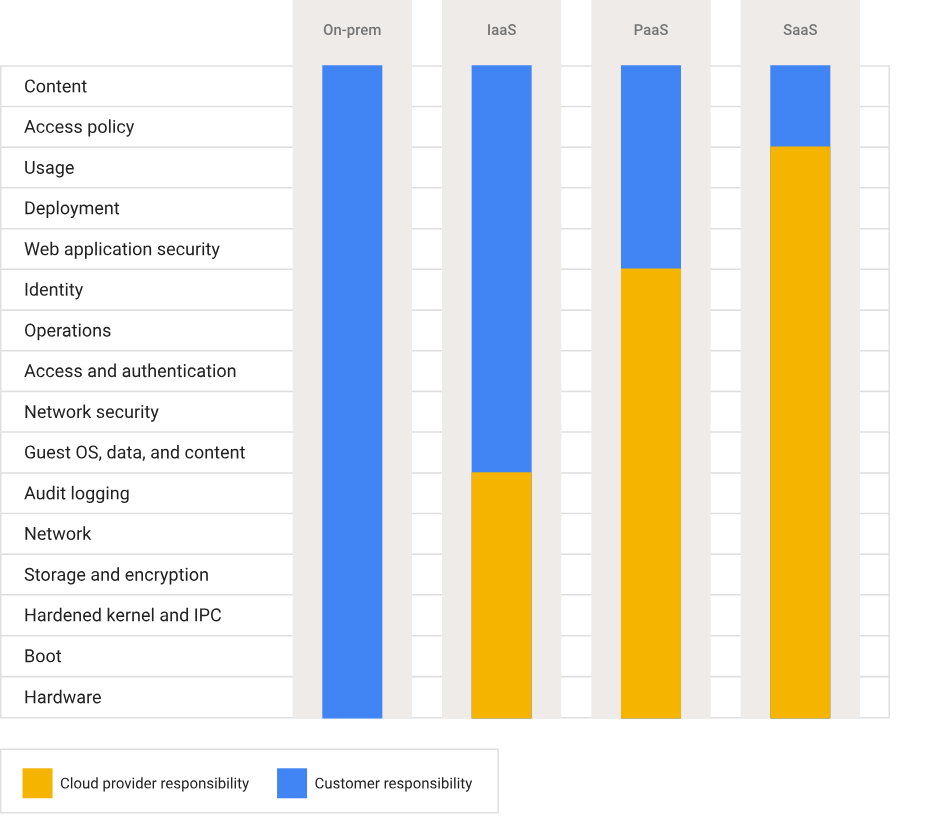

# GCP Digital Transformation
## Introduction
In today's rapidly evolving digital landscape, businesses are increasingly turning to cloud computing to drive innovation, enhance agility, and achieve competitive advantage. Google Cloud Platform (GCP) offers a comprehensive suite of services that enable organizations to embark on their digital transformation journey. This document provides an overview of how GCP can facilitate digital transformation, highlighting key services and best practices for leveraging the platform effectively.

## Why Cloud Technology is Transforming Business

**Paradigm Shift** - A fundamental and irreversible change in the way that humans work and engage with the world

**Digital Transformation** - When an organisation uses **new digital technologies**, such as public, private, and hybrid cloud platforms **to create or modify** business process, culture, and customer experiences to **meet the needs** of changing business and market dynamics.

Organisations choose digital transformation frameworks to:
- Foster innovation - Create new products and services 
- Generate new revenue streams - Create new business models
- Adapt to market changes - Respond to market changes faster
- Adapt to customer needs - Deliver better customer experiences

Digital transformation helps organisations to:
- Change how they operate - Redefine business processes and workflows
- Redefine relationships - Engage with customers, partners, and employees in new ways
- Modernise applications - Migrate and modernise legacy applications to the cloud
- Create services - Develop new digital products and services
- Deliver value - Accelerate time to market and improve operational efficiency

**Cloud** - a metaphor for the network of data centers which store and compute information that's avaiable through the internet. A model for enabling universal, convenient, on-demand network access to a shared pool of configurable computing resources (e.g., networks, servers, storage, applications, and services) that can be rapidly provisioned and released with minimal management effort or service provider interaction.

**Cloud Technology** - The use of cloud computing services to deliver various applications and services over the internet, allowing organisations to scale their operations and reduce costs.

**Cloud Native** - An approach to building and running applications that fully exploits the advantages of the cloud computing delivery model. Cloud-native applications are designed to be scalable, resilient, and manageable, often leveraging microservices architecture, containerization, and continuous integration/continuous deployment (CI/CD) practices.

### Cloud Deployment Models

- On premise
  - Hosted onsite in an organisation's own data center
  - Runs in a local environment and is managed by the organisation's IT team
  - Traditional model for IT infrastructure  
  - Owners have full control over hardware and software
  - Doesn't require 3rd party access
  - Requires significant upfront investment, physical space, and ongoing maintenance
  - Difficult to scale quickly and may not be as flexible as cloud-based solutions
  
- Private cloud - Org has virtualised servers in its own on prem data center or hosted by a private cloud prvider to create a private dedicated cloud environment for their exclusive use.
  - Accessed through the internet or a private network, but resources are not shared with other organisations
  - Similar ongoing maintenance and management requirements as on-premises solutions but more customizable and scalable than traditional on-premises infrastructure
  - Offers benefits of public cloud
    - Self-service
    - Scalability
    - Flexibility
    - Elasticity
  - Provides greater control and security compared to public cloud, as resources are not shared with other organisations
  - Best suited for orgs that have made significant infrastructure investments or if data must be kept on-premises
- Public cloud
  - On-demand computing services are managed by third-party cloud service providers
  - Offers scalability, flexibility, and cost-effectiveness
  - Requires minimal upfront investment and maintenance (only pay for what you use)
  - May have concerns regarding data security and compliance
  - Shared with multiple organisations or tenants through public internet
- Hybrid cloud - A combination of on-premises infrastructure and public and/or private cloud services
  - Combines on-premises infrastructure with public and/or private cloud services
  - Allows organisations to leverage the benefits of both environments while maintaining control over sensitive data and applications
  - Can expand their cloud computing capacity without increasing their data center expenses.
  - Provides flexibility to choose where to run workloads based on factors such as performance, security, and cost reducing downtime and over dependence on a single source of failure
  - Enables seamless integration between on-premises and cloud resources, allowing for greater agility and scalability
- Multi-cloud - describes architectures that combine at least two public cloud providers, has similar benfefits as hybrid cloud.
  - Utilizes multiple cloud services from different providers to meet specific business needs
  - Avoids vendor lock-in and allows organisations to leverage the best features and capabilities of each provider
  - Wider choice of tools and developer talent can be applied to a particular business problem, which means responding better to changing market demands
  - Requires careful management and integration to ensure seamless operation across different cloud environments

### Benefits of Cloud Computing
- Scalable - allows organisations to easily scale their resources up or down based on demand, providing flexibility and cost-efficiency (reducing cap ex & fixed infrastructure costs)
- Flexible - offers a wide range of services and tools that can be accessed anywhere and tailored to meet specific business needs, enabling organisations to innovate and adapt quickly to changing market conditions
- Agile - enables organisations to rapidly deploy and iterate on applications and services, fostering a culture of innovation and continuous improvement without underlying infrastructure constraints
- Strategic - allows organisations to focus on their core business objectives and innovations, rather than managing and maintaining IT infrastructure, enabling them to drive digital transformation and achieve competitive advantage
- Secure - provides robust security measures and compliance certifications to protect data and applications, giving organisations confidence in the safety of their digital assets while leveraging the benefits of cloud computing
- Cost-effective - offers a pay-as-you-go pricing model, allowing organisations to only pay for the resources they use, reducing upfront costs and enabling better budget management while leveraging the benefits of cloud computing

### Challenges that lead to digital transformation
- Unifying data - Integrating and managing data from various sources (streams, lakes, warehouses, databases) can be complex, requiring robust data management strategies and tools to ensure data quality, consistency, and accessibility across the organisation.
- Optimum technology infrastructure - Selecting and implementing the right technology infrastructure to support digital transformation initiatives can be challenging, as it requires careful consideration of factors such as scalability, security, and compatibility with existing systems.
- Hybrid workplace - Adapting to a hybrid workplace model, where employees work both remotely and in-office, can present challenges in terms of communication, collaboration, and maintaining a cohesive company culture.
- Security and compliance - Ensuring the security of data and applications while complying with relevant regulations and industry standards can be complex, requiring organisations to implement robust security measures and stay up-to-date with evolving compliance requirements.
- Sustainability - Balancing the need for digital transformation with environmental sustainability goals can be challenging, as organisations must consider the energy consumption and carbon footprint of their technology infrastructure while striving to achieve their digital transformation objectives.

### Transformation Cloud
- Data - Manage across entire data lifecycle to let organisations identify and process data with great scale, speed, security and reliabilty
- Open Infrastructure - Migrate from a single service provider or closed tech stack to hybrid, multi cloud approaches based on open source software while leaving the operation, governance and evolution to GCP
- Trust - Helps organisations protect their data and applications with security, privacy, compliance and transparency built in, so they can focus on innovation and growth. Orgs see cloud as more secure than on-prem as better visibility to find, analyse, resist and remediate threats at a global scale. 
- Sustainable Technology and Solutions - Help organisations reduce their emissions, carbon footprint and achieve their sustainability goals by providing energy-efficient infrastructure, renewable energy options, and tools to measure and optimize their environmental impact.

**Data** - The foundation of digital transformation, enabling organisations to make informed decisions, drive innovation, and create new business opportunities.

**Open Source** - Refers to software whose source code is publicy accesible and free for anyone to use, modify and share. A decentralised community generally develops open-source software as a public collaboration, based on philosophy of transparency and open forum of ideas. E.g. Linux operating system, Apache web server, and MySQL database. 

**Open standard** - Refers to software that follows particular specifications that are openly accessible and usable by anyone. They have guidelines for sfotware functionality, which help avoid venor lock in and ensure that the products that use these standards perform in an interoperable way. E.g. HTTP for requesting content from a web server, HTML for structuring web pages, and XML for storing structured data.

### Google Cloud Adoption Framework
Created to support customers on their cloud journey serving as a guide to help orgs adopt the cloud quickly and effectively. It does this by structuring and aligning short term , mid-term, and long term strategic and tactical business objectives. 

A cloud maturity assessment helps to establish where an organisation is currently in their cloud joruney and identify areas for improvement. 

## Funamental Cloud Concepts

**Total Cost of Ownership (TCO)** - A comprehensive approach to calculating the cost of cloud adoption against the cost of running their current on-premises systems. On prem has static costs (hardware, software, maintenance (power, cooling), staffing) while cloud has dynamic costs (pay-as-you-go model) which are hard to predict. Intangible costs such as the opportunity cost of not adopting cloud and the potential benefits of cloud adoption (e.g. increased agility, innovation, and competitive advantage) should also be considered when evaluating the TCO of cloud adoption.

**Capital Expenditure (CapEx)** - Upfront costs associated with purchasing and deploying fixed assets for on-premises infrastructure, such as hardware (servers, printers, cooling systems) and installation expenses. These costs are typically high and are a one-time investment that may require significant financial resources and planning. Maintaining these assets is also considered CapEx because it extends their lifetime and usefulness.

Small businesses can find CapEx spending challenging because large one-time purchases are often high cost. The more money you put toward CapEx means less free cash flow for the rest of the business.

**Operational Expenditure (OpEx)** - Ongoing day-to-day costs associated with running and maintaining cloud infrastructure, such as subscription fees, data transfer costs, and support services. These costs are typically variable and can fluctuate based on usage, making it easier for organisations to manage their expenses and scale their resources as needed without significant upfront investment.

Moving to cloud’s on-demand OpEx model enables organizations to pay only for what they use and only when they use it. Budgeting and forecasting is no longer a one-time operational process but must be monitored due to the dynamic nature of cloud use. 

Organizations save on power, cooling, and floor space; they save on management because they don’t have to install, operate, upgrade, and troubleshoot it themselves.

### Network
Is the foundation of cloud computing enabling connectivity and communication between cloud resources, applications, and users over the internet. A fast, reliable and low-latency global network ensures exceptional user experience and high performance making it easy to communicate and manage data globally. 

**How does a network work?**
- Data is transmitted as pulses of light over fiber optic cables which contain one or more optical fibers which are thin strans of glass or plastic that can transmit data over long distances with minimal loss of signal quality.
- An ecosystem of undersea cables, terrestrial cables, and satellite links connects data centers and users around the world, enabling global connectivity and communication.
- This global infrastructure is built by a rich ecosystem of network providers, including telecommunications companies, internet service providers (ISPs), and cloud service providers like Google Cloud, who invest in building and maintaining the network infrastructure to ensure reliable and high-performance connectivity for their customers.
- Network protcols such as IP (Internet Protocol) and TCP (Transmission Control Protocol) govern how data is transmitted and routed across the network, ensuring that data packets are delivered accurately and efficiently to their intended destinations.
- IP addresses are used to identify a network or devices on a network, while DNS (Domain Name System) translates human-readable domain names into IP addresses, allowing users to access websites and services using familiar names instead of numeric IP addresses.
- Every time a user visits a website, the computer performs a DNS lookup to a server which stores a database of domain names and their corresponding IP addresses. Like a phone book of the web. 

**Bandwidth** - is a measure of how much data a network can transfer in a given amount of time, typically measured in terms of "megabits per second" (Mbps) or "gigabits per second" (Gbps). Higher bandwidth allows for faster data transfer and better performance, especially for applications that require large amounts of data to be transmitted, such as video streaming or online gaming.

**Latency** - is the amount of time it for data to travel from one point to another. Typically measure in milliseconds, latency, sometimes called lag or "ping" describes delays in communication over a network.

### Google Cloud Regions and Zones
Google has invested billions of dollars to build global network based in seven major locations: 
- North America
- South America
- Europe
- Asia
- Australia
- Middle East
- Africa

Having multiple locations is important to allow users to choose where to run their applications and store their data, which can help improve performance, availability, durability, reduce latency, and meet regulatory requirements.

Regions represent independent geographic areas and are composed of zones. E.g. London / europe-west2 is a region and europe-west2-a, europe-west2-b, and europe-west2-c are zones within that region. 

A zone is an area where Google Cloud resources are deployed. 

Each zone is isolated from other zones in the same region to provide high availability and fault tolerance.

Multi-region locations are are 2 geographic areas separated by at least 160km that contain multiple regions, providing even greater redundancy and availability. E.g. europe is a multi-region location that includes multiple regions such as europe-west1, europe-west2, and europe-west3.

**Edge Network** - a place where a device or an organisation's network connects to the Internet. It's called "edge" because it's the entry point to the network. When a user open a Google app, Google responds to that request from an edge network location that will provide the lowest latency. 

Google Edge Network is how Google connect with ISPs to get traffic to an from users. It's made up of network infrastructure that organisations can hand off traffic to based on users needs, performance and cost. 

## Cloud Computing Models and Shared Responsibility

"As a service" refers to the way IT resources are consumed in these models.

In tradition IT, an org consumes resources, such as hardware, software and dev tools by purchasing, installing, managing and maintaining them in its own on-prem or self managed data center. Orgs are responsible for everything, from the physical infrastructure to the applications and data when it's completely on-premises.

In cloud computing, the cloud service provider owns, manages and maintains the resources. The customer consumes those resources are a service, which are provided on a subscription or pay-as-you-go basis.

**Infrastructure as a Service (IaaS)** - computing model that offers the on-demand availabilty of almost infinitely scalable infrastrcture resources such as compute, networking, storage, and databases as services over the internet.
- Economical: Allows orgs to lease resources on a pay-as-you-go basis, eliminating the need for upfront capital investment
- Scalable: Resources can be scaled up or down as needed.
- Productive: Provides same tech and capabilities as on-premises infrastructure but with the added benefits of cloud computing, such as scalability, flexibility, and cost-effectiveness without having to physically manage and maintain the underlying infrastructure. 
- Efficient: IaaS reduces CapEx and transforms it into OpEx, allowing orgs to pay only for the resources they use and when they use them, providing better budget management and financial flexibility.
- Reliable: No single point of failure as if even one component fails, the cloud provider can automatically provision resources from another location to ensure high availability and reliability.
- Use case: For orgs with unpredictable workloads, such as startups or businesses with seasonal spikes in demand or business growth the outpaces infrastructure capacity, IaaS allows them to quickly scale their resources up or down as needed without the need for significant upfront investment in hardware and infrastructure.
- Examples: Google Compute Engine, Google Cloud Storage, Google Cloud SQL

**Platform as a Service (PaaS)** - computing model that provides a platform that allows customers to develop, run, and manage applications without the complexity of building and maintaining the underlying infrastructure. Customers have control over the applications and data but not the underlying infrastructure.
- Reduced development time: Provides pre-built tools, frameworks, and services that can accelerate the development process, allowing developers to focus on building applications rather than managing infrastructure.
- Scalability: Automatically scales resources based on demand, ensuring that applications can handle varying workloads without
- Reduced management: Abstracts away the management of underlying resources by offloading infrastructure management, patches, updates, and other admin tasks to the cloud provider
- Flexible: Supports multiple programming languages, frameworks, and tools, allowing developers to choose the best technologies for their applications without worrying about compatibility or infrastructure constraints.
- Use case: For orgs that want to create unique and custom applications without investing in and managing the underlying infrastructure
- Examples: Google App Engine, Google Cloud Functions, Google Cloud Run

**Software as a Service (SaaS)** - computing model that offers an entire application, managed and hosted by a cloud provider. Customers access the application over the internet and do not have to worry about managing the underlying infrastructure, platform, or software. Customers have control over their data and how they use the application but not the underlying infrastructure or software.
- Low maintenance: The cloud provider is responsible for managing and maintaining the application, including updates, patches, and security, reducing the burden on customers to manage and maintain the software.
- Cost-effective: Offers a subscription-based pricing model, allowing customers to pay for the software on a monthly or annual basis, eliminating the need for upfront investment in software licenses and infrastructure. This makes predicting costs and per-user budgeting easier for customers.
- Flexible: Provides access to the application from any device with an internet connection, allowing users to work from anywhere and collaborate with others in real time.
- Use Case: For orgs that want to use software applications without the need to manage and maintain the underlying infrastructure or software and minimal customisation, such as email, collaboration tools, customer relationship management (CRM) software, and enterprise resource planning (ERP) software.
- Examples: Google Workspace, Google Cloud Identity, Google Cloud Security Command Center

Abstraction is the process of hiding the underlying complexity of the implmentation as you move up the stack. IaaS provides the least amount of abstraction, while SaaS provides the most and requires the least amount of knowledge and management of the infrastructure.

**Shared Responsibility Model** - A framework that defines the division of responsibilities between the cloud service provider and the customer in terms of security, compliance, and management of cloud resources. The specific responsibilities may vary depending on the cloud service model (IaaS, PaaS, SaaS) and the specific services being used.

Cloud provider is responsible for securing the parts of the cloud that it directly controls, such as hardware, networks, and physical security.

The customer is responsible for securing anything that they create within the cloud, such as the configurations, access policies, and user data.