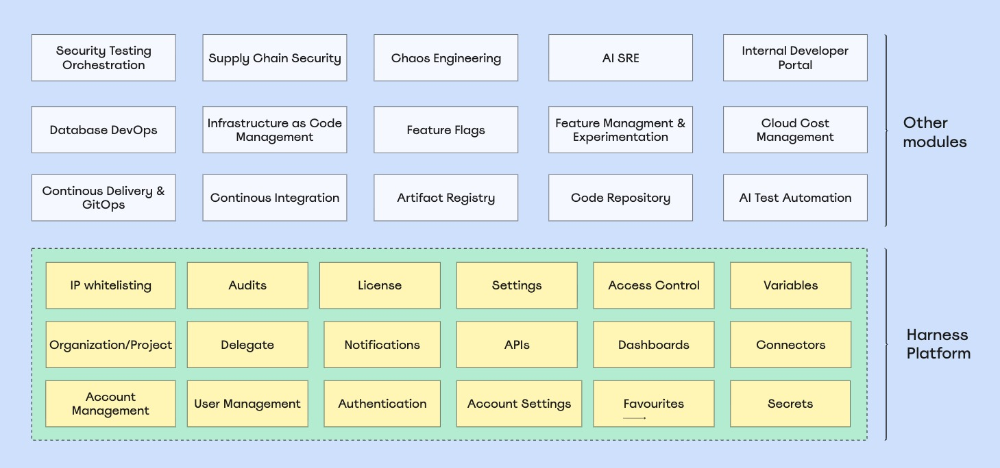
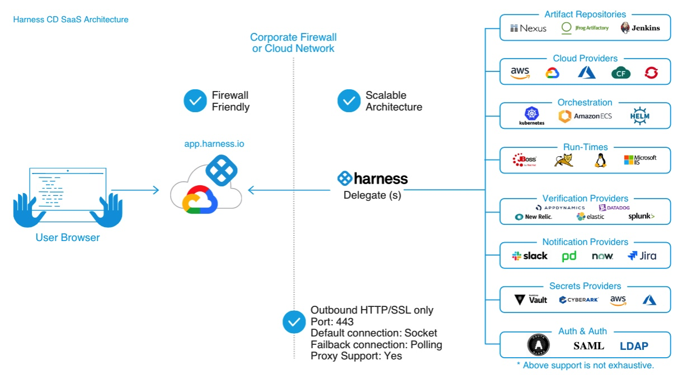

# Harness
Harness is a modern software delivery platform designed for enterprise level scale and developer productivity. It provides a comprehensive set of tools and features to automate the entire software delivery process, from code commit to production deployment. Harness aims to simplify and accelerate the software delivery lifecycle while ensuring reliability, security, and compliance.

## Harness Platform
The Harness platform is built on a modular architecture that allows organizations to choose and integrate the components they need for their software delivery process. The key modules of the Harness platform include:

Modular architecture:
* CI (Continuous Integration): Automates the process of building, testing, and integrating code changes. It allows developers to quickly identify and fix issues in their code before they are deployed to production.
* CD (Continuous Delivery): Automates the process of deploying code changes to production. It allows teams to release new features and updates to customers faster and more frequently, while ensuring that the deployment process is reliable and consistent.
* STO (Security Testing Orchestration): Provides security testing capabilities (like SAST, DAST, SCA, etc.) within CI/CD pipelines to identify and address vulnerabilities in the software. It integrates with various security tools and frameworks to ensure that security is an integral part of the software delivery process.
* CCM (Cloud Cost Management): Helps organizations manage and optimize their cloud costs by providing insights into cloud usage and spending. It allows teams to identify cost-saving opportunities and make informed decisions about their cloud infrastructure.
* 

## Harness Account, Organization, and Project
* Account: Highest level of organization in Harness. Defines the organisational structure, manage global settings and control access across all users and projects. 
* Organization: Groups together projects that share a common purpose or business goalIt allows for better management and isolation of resources.
* Project: Where teams do their day-to-day work. Projects contain the pipelines, users, and resources needed to build, deploy, test, and operate applications.Projects give teams a shared workspace while allowing them to operate independently.
  

## Harness Delegate
A Harness Delegate is a lightweight, secure, and scalable agent that runs in your infrastructure and executes tasks  by connecting with your artifacts, code repositories, and deployment targets with Harness Platform.

It acts as a bridge between the Harness platform and your applications, allowing you to automate various tasks such as Git clones, run unit tests, and execute deployment scripts in your target infrastructure (e.g., Kubernetes clusters, Docker environments). Delegates connect to the Harness Platform using outbound-only HTTP/HTTPS.

* Kubernetes Delegate: A Harness Delegate that runs as a Kubernetes pod and can be used to execute tasks in a Kubernetes environment. It is designed to work seamlessly with Kubernetes and can be easily deployed and managed within a Kubernetes cluster.

* Docker Delegate: A Harness Delegate that runs as a Docker container and can be used to execute tasks in a Docker environment. It is designed to work seamlessly with Docker and can be easily deployed and managed within a Docker environment.
  

### Running a new Delegate
1. Create a new Delegate in Harness and select the appropriate type (Kubernetes or Docker).
2. Install Delegate - Copy the YAML to a machine with kubectl installed and with access to your Kubernetes cluster. 
3. Start a Kubernetes cluster (e.g via Docker Desktop)
4. Run the following command to install the Harness Delegate in your Kubernetes Cluster. `kubectl apply -f harness-delegate.yml`
5. Verify pod is running with `kubectl get pods -n harness-delegate-ng` and then verify Delegate is connected in Harness Manager by checking heartbeat is recieved.

## Harness Connector
Integrates and connects Harness to your tools, such as Kubernetes clusters, code and artifact repositories, and cloud platforms.

For example, a GitHub connector authenticates with a GitHub account and fetches files a part of a build or deploy stages in a pipeline.

### Connecting Kubernetes Cluster Connector
1. Create a Kubernetes Cluster Connector in Harness and select the appropriate authentication method (e.g. Use credentials of a specific Harness Delegate).
2. Select running Kubernetes Delegate

## Harness Pipeline
Represents a workflow and includes pipeline-level settings, stages and steps. Pipeline can cover integration, delivery, operations, testing, deployment, real-time changes, and monitoring. 

For example, a pipeline can use the CI module to build, test and push code, and then a CD module to deploy the artifact to the production environment. 

## Harness Stage
A stage is a subset of a pipeline that contains the logic to perform one major segment of the pipeline process. 

## Harness Template
A template is a reusable component that can be used across multiple pipelines and stages. It allows you to define a set of steps or stages that can be easily reused in different pipelines, reducing duplication and improving maintainability.