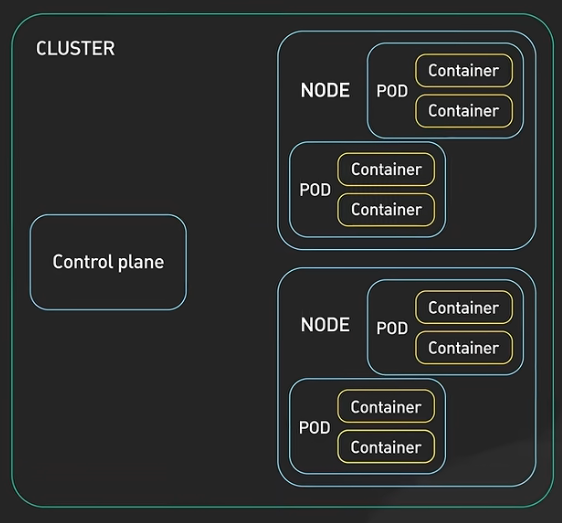
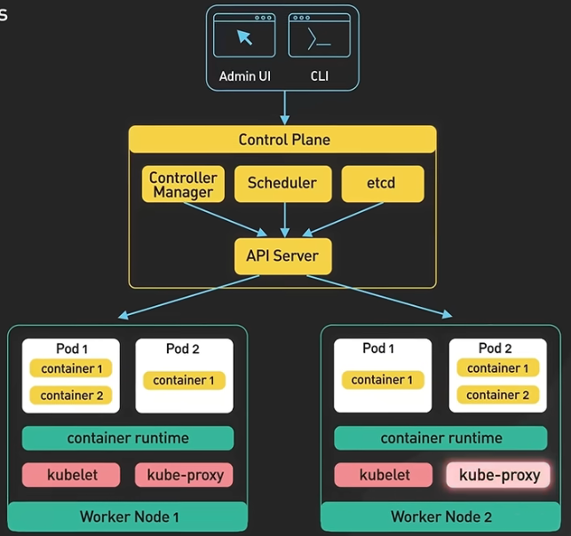

# Kubernetes
Kubernetes is an open-source container orchestration platform that automates the deployment, scaling, and management of containerized applications. It provides a framework for running distributed systems resiliently, with features such as service discovery, load balancing, automated rollouts and rollbacks, self-healing, and secret and configuration management.



## Components of Kubernetes
- **Cluster** - a group of nodes that run containerized applications using Kubernetes.
- **Master Node** - the control plane of the Kubernetes cluster, responsible for managing the cluster's state and making global decisions about the cluster, e.g API server, etcd, controller manager, scheduler. The master node exposes the Kubernetes API and serves as the entry point for administrators and users to interact with the cluster.
- **Worker Node** - a machine that runs the Kubernetes container runtime (e.g., Docker) and the Kubelet, which is responsible for starting & managing pods on the node. Each node has multiple pods running on it, and the node communicates with the Kubernetes control plane to receive instructions and report its status. Kube proxy is a network proxy that runs on each node and maintains network rules for pod communication.
- **Pod** - smallest unit of K8s and is an abstraction over containers. A pod can contain one or more containers that share the same network namespace and storage. Each pod is assigned a unique internal IP address upon creation, and containers within a pod can communicate with each other using localhost.
- **Service** - a permanent IP address that can be used to access a set of pods. Services provide a stable endpoint for accessing pods, even if the underlying pods are created or destroyed. External service opens communication from external sources to the pods. Internal service opens communication between pods within the cluster.
- **Ingress** - a collection of rules that allow inbound connections to reach the cluster services. Ingress can provide load balancing, SSL termination, and name-based virtual hosting. Ingress is implemented by an Ingress Controller, which is responsible for fulfilling the Ingress rules.
- **ConfigMap** - a Kubernetes object that stores non-confidential external configuration data in key-value pairs. ConfigMaps allow you to decouple configuration artifacts from image content, making your applications more portable and easier to manage.
- **Secret** - a Kubernetes object that stores sensitive information, such as passwords, OAuth tokens, and SSH keys. Secrets are similar to ConfigMaps but are specifically designed to handle confidential data. They can be used to securely pass sensitive information to pods without exposing it in the application code or configuration files.
- **Volumes** - a Kubernetes object that provides persistent storage for pods, if database container/pod is restarted data needs to be preserved. Volumes can be used to store data by attaching physcial storage e.g hard drive / remote storage to pod that needs to persist across pod restarts or to share data between containers in a pod.
- **Deployment** - a Kubernetes object that manages the lifecycle of pods for stateless applications and ensures that the desired number of replicas are running at any given time.
- **StatefulSet** - a Kubernetes object that manages the lifecycle of pods for stateful applications and provides guarantees about the ordering and uniqueness of pod instances. StatefulSets are used for applications that require stable network identities, persistent storage, and ordered deployment and scaling.

## Running Kubernetes Locally
**MiniKube**

When setting up typical production cluster you'll have multiple master nodes and multiple worker nodes. 

For development and testing purposes, you can use MiniKube to run a single-node Kubernetes cluster on your local machine. 

MiniKube is a lightweight Kubernetes implementation where master processes and worker processes are running on the same node with Docker runtime preinstalled, allowing you to experiment with Kubernetes features and deploy applications in a controlled environment.

**Kubectl** - is a cmd line tool that allows you to run commands against Kubernetes clusters. You can use `kubectl` to deploy applications, inspect and manage cluster resources, and view logs. Kubectl communicates with the Kubernetes API server to perform operations on the cluster, making it an essential tool for interacting with and managing Kubernetes resources.

Install MiniKube - https://minikube.sigs.k8s.io/docs/start/?arch=%2Fwindows%2Fx86-64%2Fstable%2F.exe+download

- `minikube start` - Start a local Kubernetes cluster using MiniKube. This command initializes a single-node Kubernetes cluster on your local machine, allowing you to experiment with Kubernetes features and deploy applications in a controlled environment.
- `kubectl get po -A` - List all pods across all namespaces in the Kubernetes cluster. This command provides an overview of the running pods, their status, and the namespaces they belong to, helping you monitor and manage your applications effectively.
- `minikube dashboard` - Opens the Kubernetes dashboard in your default web browser. The dashboard is a web-based user interface that allows you to manage and monitor your Kubernetes cluster, view resource usage, and perform various administrative tasks.
- `kubectl get nodes` - List all nodes in Kubernetes cluster
- `kubectl get pod` - List all pods in Kubernetes cluster
- `kubectl get svc` - List all services in Kubernetes cluster
- `kubectl create deployment <deployment_name> --image=<image_name>` - Create a new deployment in the Kubernetes cluster using the specified image. This command allows you to deploy applications and manage their lifecycle, ensuring that the desired number of replicas are running at any given time.
- `kubectl get deployment` - List all deployments in Kubernetes cluster
- `kubectl exec -it <pod_name> -- /bin/bash` - Execute a command in a running pod. This command allows you to access the pod's container and run commands interactively, which is useful for debugging and troubleshooting applications running in the cluster.
- `kubectl apply -f <file_name>.yaml` - Apply a configuration file to the Kubernetes cluster. This command allows you to create or update resources defined in the YAML file, enabling you to manage your applications and infrastructure declaratively.

**Layers of Abstraction**
- Deployment - manages a ReplicaSet
- ReplicaSet - manages a set of Pods
- Pod - is an abstraction for a container

### YAML Config File
`depmoyment.yaml` is a YAML file that defines the desired state of a Kubernetes deployment. It specifies the number of replicas, the container image to use, and other configuration details for the deployment. The YAML file is used by `kubectl` to create and manage the deployment in the Kubernetes cluster.
```yaml 
apiVersion: apps/v1
kind: Deployment
metadata:
  name: my-deployment
spec:
  replicas: 3
  selector:
    matchLabels:
      app: my-app
  template:
    metadata: # applies to pods created by deployment
      labels:
        app: my-app # label for pod service selection
    spec: # blueprint for pod
      containers:
        - name: my-container
          image: my-image:latest
          ports:
            - containerPort: 80
```

`service.yaml` is a YAML file that defines the desired state of a Kubernetes service. It specifies the type of service, the selector for matching pods, and the ports to expose. The YAML file is used by `kubectl` to create and manage the service in the Kubernetes cluster.
```yaml
apiVersion: v1
kind: Service
metadata:
  name: my-service
spec:
  selector:
    app: my-app # selects pods with label app: my-app
  ports:
    - protocol: TCP
      port: 80
      targetPort: 80
```

1. metadata - contains information about the deployment, such as its name and labels.
2. spec - defines the desired state / attributes of the deployment, including the number of replicas, the selector for matching pods, and the pod template. The attributes are specific to the kind of resource being defined (e.g., Deployment, Service, etc.) and are used by Kubernetes to create and manage the resource in the cluster.
3. status - provides information about the current state of the deployment, including the number of available replicas and the conditions of the deployment. The status is updated by the Kubernetes control plane as the deployment progresses and changes over time.

## Browser Request Flow through K8s Components
1. A user sends a request to the application through a web browser.
2. The request is received by the Ingress Controller, which is responsible for routing incoming traffic to the appropriate service based on the defined Ingress rules.
3. The Ingress Controller forwards the request to the corresponding Service (e.g. Mongo Express), which acts as a stable endpoint for accessing the pods running the application.
4. The Service selects one of the available pods based on its selector and load balancing strategy, and forwards the request to that pod (Mongo Express pod).
5. The pod receives the request and processes it, interacting with the application code and any necessary resources (e.g., internal service like databases (MongoDB pod -> MongoDB pod), external APIs) to generate a response.
6. The pod sends the response back to the Service, which then forwards it to the Ingress Controller.
7. The Ingress Controller sends the response back to the user's web browser, completing the request-response cycle.

## Secret Management in Kubernetes
Kubernetes provides a built-in mechanism for managing sensitive information, such as passwords, API keys. 

`kubectl apply -f mongo-secret.yaml` - Create a secret in the Kubernetes cluster using the specified YAML file. This command allows you to securely store sensitive information, such as database credentials, and make it available to pods without exposing it in the application code or configuration files.