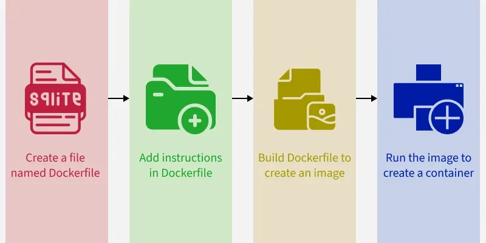

# Docker
Docker is a virtualization platform that allows developers to easily create, deploy, and run applications in containers. Containers are lightweight, portable, and self-sufficient environments that can run applications consistently across different computing environments.

Traditional applications often require complex setups and dependencies, which can lead to issues when deploying across different environments.

* Setup hardware
* Install operating system (e.g., Linux, Windows)
* Install necessary software and dependencies (e.g., databases, libraries)
* Configure the application to work with the installed software
* Install the application itself

Docker solves this problem by packaging applications and their dependencies into a single container that can run on any system with Docker installed.

Deployment steps using Docker:
1. **Create a Dockerfile**: A Dockerfile is a text file that contains instructions on how to build a Docker image. It specifies the base image, the application code, and any dependencies needed to run the application.
2. * **Build the Docker image**: Use the `docker build` command to create a Docker image from the Dockerfile. The Docker image is an executable application artifact that contains everything needed to run the application e.g. the code, runtime, libraries etc.
3. **Run the Docker container**: Use the `docker run` command to start a container from the built image. The container will run the application as an instance of the image in an isolated environment, ensuring consistency across different systems.



## Dockerfile
A Dockerfile is a text file that contains instructions for building a Docker image. It specifies the base image, the application code, and any dependencies needed to run the application. Here is an example of a simple Dockerfile:

```Dockerfile
# Use an official Node.js runtime as the base image
# Must begin with FROM instruction - to specify the base image
FROM node:25.8

# Set the working directory in the container
COPY package.json /app/
COPY server.js /app/

WORKDIR /app

# RUN instruction to execute commands in a shell inside the container during the build process. It is used to install dependencies, set up the environment, and perform other tasks needed to prepare the image for running the application.
RUN npm install

# CMD instruction to specify the default command to run when starting a container from the image. It is used to define the command that will be executed when the container starts, such as running the application or starting a server. Only one CMD instruction is allowed in a Dockerfile, and if multiple CMD instructions are present, only the last one will take effect.
CMD ["node", "server.js"]
```


**Docker Registry** - A Docker registry is a collection of repositories for storing and distributing Docker images. The most popular public registry is Docker Hub, which allows users to share and access a wide variety of Docker images. Organizations can also set up private registries to store and manage their own images securely.

**Docker Repository** - A Docker repository is a collection of related Docker images, typically organized by application or project. Each repository can contain multiple images, which are tagged with different versions or variants of the application.

**Image Versions** - Docker images can have multiple versions, which are typically tagged with a version number or a descriptive name. This allows developers to manage different versions of their applications and easily switch between them when needed.

**Port Mapping** - When running a Docker container, you can specify port mapping to allow communication between the container running in an isolated Docker network and the host machine. This is done using the `-p` flag in the `docker run` command, which maps a port on the host to a port in the container. For example, `docker run -p 8080:80 <image_name>:<tag>` would map port 8080 on the host to port 80 in the container, allowing you to access the application running in the container through the host's port 8080.

## Docker Commands
- `docker images`: List all Docker images available on the local machine.
- `docker ps`: List all running Docker containers.
- `docker ps -a`: List all Docker containers, including those that are stopped.

- `docker build -t <image_name>:<tag> .`: Build a Docker image from a Dockerfile in the current directory, tagging it with a specified name and tag.
- `mvn spring-boot:build-image -Dspring-boot.build-image.imageName=<image_name>:<tag>`: Build a Docker image for a Spring Boot application using the Spring Boot Maven plugin, specifying the image name and tag.

- `docker pull <image_name>:<tag>`: Pull a Docker image from a registry.


- `docker run <image_name>:<tag>`: Run a Docker container from a specified image. If the image is not available locally, Docker will automatically pull it from the registry before running the container.
- `docker run -d <image_name>:<tag>`: Run a Docker container in detached mode (in the background). 
- `docker run --name <container_name> <image_name>:<tag>`: Run a Docker container with a specified name.
- `docker run -p <host_port>:<container_port> <image_name>:<tag>`: Run a Docker container with port mapping, allowing access to the application running in the container through the specified host port.
- `docker start <container_id>`: Start a stopped Docker container.
- `docker stop <container_id>`: Stop a running Docker container.
- `docker rm <container_id>`: Remove a stopped Docker container.

- `docker tag <image_name>:<tag> <new_image_name>:<new_tag>`: Tag an existing Docker image with a new name and tag, allowing you to manage different versions of your images.
- `docker push <image_name>:<tag>`: Push a Docker image to a registry, making it available for others to pull and use.
