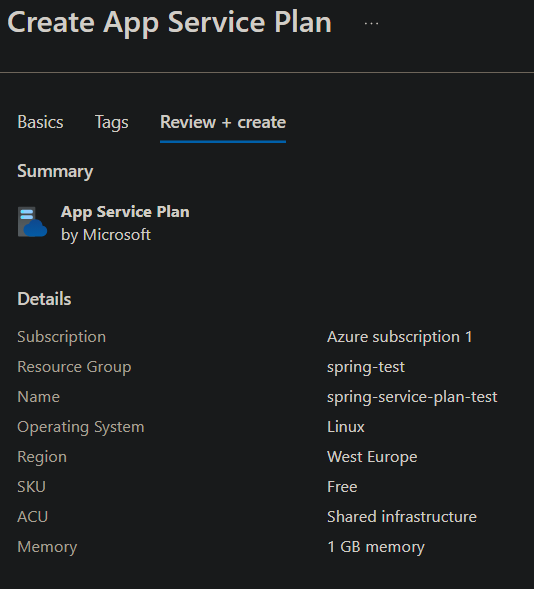
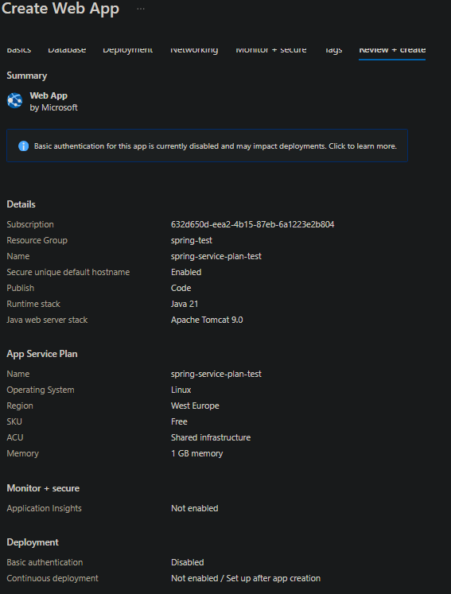
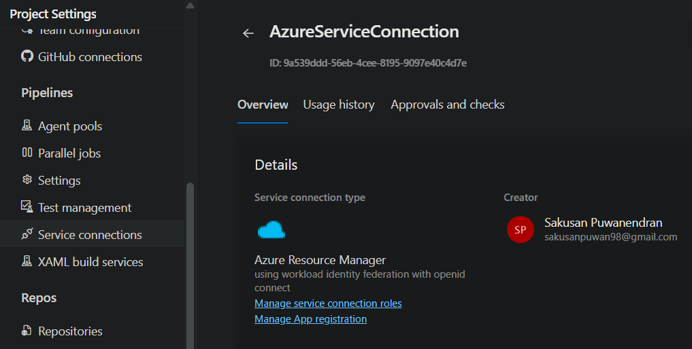
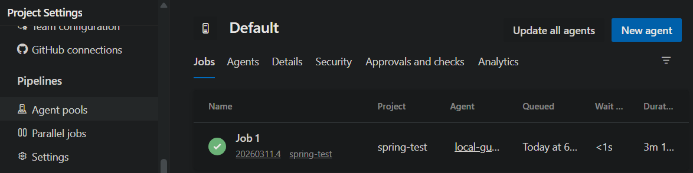

# Azure Setup

1. Create App Service Plan
   

2. Create Web App

Note: Choose Java 21 SE instead of Apache Tomcat if you are using Spring Boot.

3. Create Azure Resource Manager service connection

Enable *Grant access permission to all pipelines*

4. Create a file in repo named `azure-pipelines.yml` 

    **azureSubscription**: The name of the Azure Resource Manager service connection that you created in the previous step.  

    **appType**: The type of the Azure App Service. For example, `webAppLinux` for a Linux web app or `webApp` for a Windows web app.  

    **appName**: The name of the Azure App Service that you created in the previous step.

5. Create an Azure Pipeline in Azure DevOps and select the option to use an existing YAML file in the repository.

6. Under free tier, the Azure DevOps org may not have enough parallel jobs to run the pipeline. Create a local machine (agent) to the run the build.

* New agent
* Download and extract the Windows agent
* Run `config.cmd` and follow the prompts to configure the agent. 
  * *server URL*: The URL of your Azure DevOps organization (e.g., `https://dev.azure.com/yourorganization`)
  * *authentication type*: Choose the authentication method you prefer (e.g., Personal Access Token)
  * *personal access token*: Generate a personal access token in Azure DevOps with the necessary permissions and provide it when prompted
  * *agent pool*: Select the default agent pool or create a new one for your local agent
  * *agent name*: Provide a name for your local agent (e.g., `LocalAgent`)
  * *work folder*: Specify the directory where the agent will store its work files (e.g., `C:\agent\_work`)
* Run `run.cmd` to start the agent and keep it running to listen for jobs from Azure DevOps.